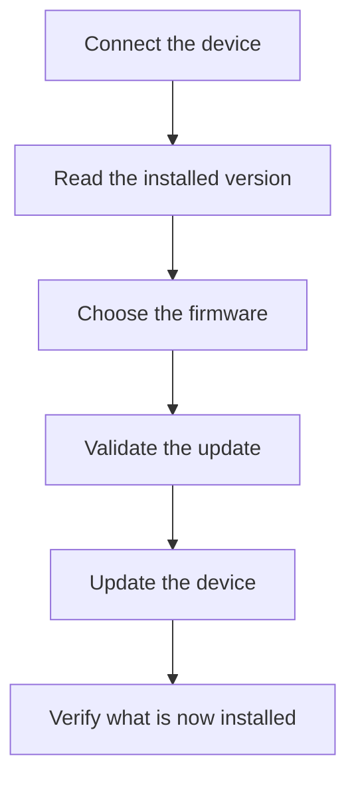
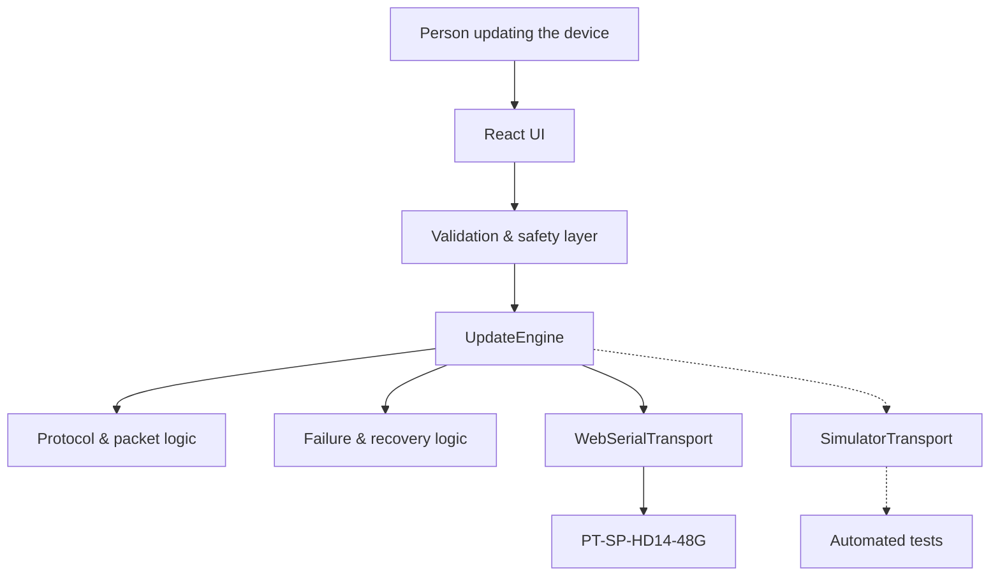

<p align="center">
  
</p>

<h1 align="center">PT-SP-HD14-48G Firmware Updater</h1>

<p align="center">
  A modern, browser-based firmware updater for the PureTools PT-SP-HD14-48G HDMI splitter.
  No desktop utility, no mystery progress bars, and no pretending that firmware updates need to feel like they were designed in 1995.
</p>

<p align="center">
  <a href="https://negruhd1448.aiexperiments.eu"><strong>Open the live app →</strong></a>
</p>
<p align="center">
  
  
  
  
  
  
  
</p>
---

## Why this exists

This project started because updating the firmware on the **PureTools PT-SP-HD14-48G** was much more painful than it had any reason to be.

The device uses a desktop application called **GTool** for firmware updates. It does the job, but the experience feels like something from another era: download a utility, connect the hardware, work your way through an awkward interface, select a binary file, press the right button, and then spend the next few minutes wondering whether the box is actually doing what you think it is doing.

It felt less like using a modern product and more like performing maintenance on one.

I kept thinking that firmware updating should not have to feel this way.

It should feel more like the kind of hardware/software experience Apple made people expect: connect the device, immediately understand its state, choose the update, know exactly what is about to happen, press one clear button, see meaningful progress, and know when the process is actually finished.

The technical complexity can still exist underneath. The person using the product should not have to absorb all of it.

So that became the goal:

> **What would this firmware updater look like if the experience had been designed first, rather than added afterward?**

Initially I thought that might simply mean building a better interface around the existing process.

It turned out to be more interesting than that.

The original GTool application was responsible for the actual conversation with the HDMI splitter, so replacing the experience properly meant understanding what the updater was doing underneath: how it identifies the installed firmware version, how it tells the device that an update is starting, how it breaks a firmware image into pieces, what the device sends back after each piece, how retries work, and how the application decides that the update is complete.

Once that communication had been reconstructed, the desktop utility stopped being a technical requirement.

So I rebuilt the updater for the browser.

---

## What I built

The result is a web application that communicates directly with the PT-SP-HD14-48G over USB using the browser's **Web Serial API**.

There is no hidden GTool process, no automation clicking through the original application, and no Windows executable running behind the page. The update protocol itself has been recreated in TypeScript.

The transition looks roughly like this:


The interesting part is that the browser now owns the entire update conversation.

From the person's perspective, the flow is intentionally boring:



That simplicity is deliberate.

There is quite a lot happening underneath it.

---

## Making a technical process feel simple without making it dumb

A good interface does not remove complexity by pretending it is not there. It handles the complexity and presents the parts that matter.

That became one of the main ideas behind this project.

The updater needs to establish a serial connection, inspect the device, validate the firmware image, prepare the hardware for an update, split the image into packets, send those packets one at a time, interpret acknowledgements from the device, resend packets when requested, stop when the protocol says something is wrong, and then verify the installed version afterward.

None of that should require the person updating the box to understand serial framing, packet indices or hexadecimal commands.

What they should understand is:

- which device they connected;
- which firmware is currently installed;
- which file they are about to install;
- whether the file looks appropriate;
- whether the update has actually started;
- how far through it they are;
- whether something went wrong;
- whether the resulting firmware could be verified.

That is the distinction I wanted the application to make.

---

## The part I underestimated: failure

Sending bytes to a USB device is not especially interesting by itself.

The more interesting question is what happens when something goes wrong **after the firmware update has already started**.

A normal web application gets to be optimistic about failure. If an API request dies, you can usually retry it. If a page fails to load, reload the page.

Firmware is different.

If the device has entered an update state and already accepted part of a firmware image, blindly retrying everything may be exactly the wrong thing to do.

A serial write can also fail in ambiguous ways. If the browser waits too long for a write to complete, it cannot necessarily prove whether zero bytes, half a packet, or the entire packet reached the device.

That means a nice friendly **Try Again** button is not automatically a good idea.

The updater is therefore deliberately conservative whenever it no longer knows enough to continue safely.

If a write becomes uncertain, the current connection is abandoned and a fresh connection is required.

If a response is malformed, the application does not guess what the device probably meant.

If the device rejects a packet, the transfer stops according to the protocol.

And if the complete firmware image is transferred but the device cannot be queried afterward, the application does not quietly convert that into a green verified-success state.

It tells the truth:

> **The firmware was transferred, but the installed version could not be verified.**

That distinction matters.

---

## One rule ended up shaping most of the project

While building this, I kept coming back to the same principle:

> **Do not invent certainty just because certainty makes for a cleaner interface.**

There are several places where that matters.

The version response recovered from the device tells us which firmware version is installed, but it does not give us a reliable electronic model identifier.

That means the software cannot honestly say:

> “I have cryptographically proven that this is a PT-SP-HD14-48G.”

So it does not.

The hardware-validation flow asks for explicit model confirmation instead.

Likewise, transferring the last firmware packet does not prove that the new firmware is now running correctly.

So transfer completion and version verification are separate states.

The UI is cleaner because those distinctions are explained clearly, not because they are hidden.

---

## A firmware updater should be difficult to activate by accident

The normal production version of this project does **not** have real firmware flashing enabled.

That is intentional.

Real device writes require three separate build-time gates:

```text
VITE_ENABLE_READ_ONLY_DEVICE_CONNECTION
VITE_ENABLE_REAL_FLASHING
VITE_ENABLE_HARDWARE_VALIDATION_MODE
```

All three default to:

```text
false
```

I did this because a destructive hardware operation should not become available because somebody accidentally exposed a button or changed a single UI condition.

The checks exist below the React interface as well.

The real hardware path also validates the firmware before it is transferred, enforces protocol limits, bounds serial reads and writes so they cannot hang forever, and requires explicit confirmation before the destructive part of the process can begin.

There is deliberately no general-purpose serial terminal in the application either.

The updater knows how to perform this update protocol. It is not designed to become a convenient browser interface for sending arbitrary bytes to hardware.

---

## The architecture

The project is intentionally split so that the UI, update logic and serial transport are not one large piece of application code.



The separation is fairly simple.

The **React UI** deals with the human being.

The **UpdateEngine** understands the firmware-update process.

The **WebSerialTransport** moves bytes between the browser and the device.

And the **SimulatorTransport** behaves like a device closely enough that the update engine can be exercised without repeatedly risking real hardware during development.

The distinction I care about most is:

> **The serial transport moves bytes. The update engine understands what those bytes mean.**

That keeps the interesting part of the project independent of React and independent of the browser implementation.

---

## So how much of this actually works?

At the software level, the project is in a pretty advanced state.

The current suite contains:

### **196 automated tests across 18 test files**

Those tests cover both the normal update path and a fairly unhealthy collection of ways things can go wrong, including:

- normal firmware transfer;
- packet retries;
- repeated retry requests;
- explicit transfer rejection;
- malformed device responses;
- invalid checksums;
- read timeouts;
- write timeouts;
- serial writes that never complete;
- disconnects during an update;
- disconnects after the final firmware packet;
- firmware-size and packet-index boundaries;
- incorrect recovery state;
- stale device identity after a dangerous failure;
- accidentally starting the update twice;
- wake-lock cleanup.

The full firmware example used while reconstructing the protocol is **112,340 bytes**.

That becomes 110 firmware packets.

The end-to-end simulated hardware path therefore performs:

```text
2 initialization commands
110 firmware packet writes
1 final version query
────────────────────────
113 serial writes
```

Those writes pass through the same `WebSerialTransport` implementation used by the real-device path.

That gives me a fairly high degree of confidence that the software constructs the protocol conversation I expect.

There is still one very important thing I am deliberately **not** claiming.

---

## Software complete. Physical validation pending.

A physical PT-SP-HD14-48G has not yet been used for the final bench-validation pass.

That means I am **not** currently claiming:

> “I successfully flashed a real production unit from the browser.”

Automated testing can prove quite a lot. It can prove the bytes being generated, packet boundaries, retry behavior, checksums, state transitions, timeout handling and recovery logic.

It cannot prove what a particular physical device will do when connected.

There are still things the real hardware needs to answer, including exactly how its USB interface enumerates, which supported response format the production unit uses, what happens to the serial connection during reboot, whether the device disappears and reappears as a port, and whether the timing recovered from GTool behaves exactly as expected on the real unit.

That is why this repository describes the current state as:

> **Software complete / hardware validation pending**

rather than treating “196 tests passed” as shorthand for “the hardware has been tested.”

The actual physical validation procedure is documented here:

[**PT-SP-HD14-48G hardware validation plan →**](docs/hardware-validation/PT-SP-HD14-48G-bench-test.md)

---

## Why put this in a browser at all?

Because after reconstructing the protocol, keeping the desktop application started to feel unnecessary.

Modern browsers can request access to serial devices directly, with the user explicitly selecting which connected device the page is allowed to communicate with.

That means the updater can go from:

```text
Find vendor utility
        ↓
Download executable
        ↓
Install / launch it
        ↓
Work out the interface
        ↓
Connect device
        ↓
Find firmware file
        ↓
Start update
```

to:

```text
Open page
   ↓
Connect device
   ↓
Update
```

Obviously the complexity has not vanished.

It has moved into the software, which is exactly where I think it belongs.

The person updating an HDMI splitter should not have to become an embedded-systems engineer for five minutes.

---

## Try the interface

The current build is running here:

### [negruhd1448.aiexperiments.eu →](https://negruhd1448.aiexperiments.eu)

The public production deployment keeps the real flashing path disabled by default.

The hardware connection itself uses the Web Serial API and therefore needs a compatible desktop browser and HTTPS.

---

## For the people who actually want the hex

Most people should be able to understand this project without knowing anything about serial protocols.

But the recovered protocol is part of the interesting work, so it is here for anyone who wants to go a level deeper.

<details>
<summary><strong>Show the recovered protocol details</strong></summary>

<br>

The updater communicates over serial at:

```text
115200 baud
8 data bits
1 stop bit
No parity
No flow control
```

The recovered firmware-version request is:

```text
A5 5B 01 13 00 00 00 00 00 00 00 00 EC
```

Before sending firmware, GTool sends:

```text
A5 5B 08 07 00 00 00 00 00 00 00 00 F1
```

and, roughly two seconds later:

```text
A5 5B 08 08 00 00 00 00 00 00 00 00 F0
```

The firmware image is divided into **1,024-byte blocks**.

Each data frame looks like this:

```text
┌────────┬──────────────┬───────────────────┬──────────┐
│ FE EF  │ Packet index │ 1024-byte payload │ Checksum │
└────────┴──────────────┴───────────────────┴──────────┘
```

That produces a **1,029-byte frame**.

The final firmware block is padded with `FF` when the file does not divide evenly into 1,024-byte chunks.

The device then responds with a status representing:

```text
0 = packet accepted
1 = send the same packet again
2 = transfer failed
```

The final packet is marked using the high bit of the packet index.

For the 112,340-byte firmware example:

```text
Firmware size:       112,340 bytes
Payload size:          1,024 bytes
Firmware packets:        110
Final packet index:       109
Final header:        FE EF 80 6D
```

The implementation also validates packet limits, framing and checksums instead of assuming that a reply is trustworthy just because some bytes arrived.

</details>

---

## Running it locally

The project is built with **TypeScript, React, Vite and Vitest**.

Clone it:

```bash
git clone https://github.com/MLupu88/PT-SP-HD14-48G-Firmware-Updater.git
cd PT-SP-HD14-48G-Firmware-Updater
```

Install the dependencies:

```bash
npm install
```

Start the development server:

```bash
npm run dev
```

The normal verification commands are:

```bash
npm run lint
npm run typecheck
npm run test
npm run build
```

There is also a Docker deployment:

```bash
docker compose up -d --build
```

The production Docker build runs the project's checks before producing the final application image.

Real hardware flashing remains disabled unless the corresponding hardware-validation gates are explicitly enabled at build time.

---

## What's where

The repository is relatively small and the important parts are separated by responsibility:

```text
src/
├── lib/
│   ├── gtool/
│   │   └── Recovered protocol, packet creation and validation
│   │
│   ├── update-engine/
│   │   └── Firmware transfer, retries, verification and recovery
│   │
│   └── webserial/
│       └── Browser serial connection and bounded I/O
│
└── ui/
    └── The actual updater experience

docs/
└── hardware-validation/
    └── Physical bench-test procedure
```

The firmware `.bin` itself is treated as binary data.

This project did not require disassembling or reconstructing the firmware running inside the splitter. The problem was understanding the **update protocol around it**, which is a much narrower and more useful problem for what I wanted to build.

---

## What I like about this project

I originally wanted a better firmware updater.

That is still what the project is.

But somewhere along the way it also became an interesting example of how much software exists simply because nobody has questioned the boundary around it.

At the beginning, GTool looked like part of the product. If you wanted to update this box, you used GTool. That was just how the hardware worked.

Except it wasn't.

The hardware did not care about GTool.

It cared about a particular conversation happening over a serial connection.

Once that conversation was understood, the desktop application became just one possible implementation of it.

That meant it could be replaced with a protocol engine, the protocol engine could be tested independently, and the whole thing could be put behind a much simpler browser experience.

So the part I find most interesting is not that a firmware updater now runs in a browser.

It is that something which initially looked like a fixed limitation of the product turned out to be an implementation choice.

And implementation choices can be changed.

---

## Disclaimer

This is an **independent, unofficial project** and is not affiliated with, endorsed by, sponsored by, or maintained by PureLink GmbH or PureTools.

`PureLink`, `PureTools`, `PT-SP-HD14-48G`, GTool and other referenced product names belong to their respective owners.

Firmware installation can render hardware unusable when performed with an incorrect firmware image, protocol or target device.

Physical validation of this implementation against a PT-SP-HD14-48G is still pending, so the real flashing path should currently be considered **hardware-unvalidated**.
